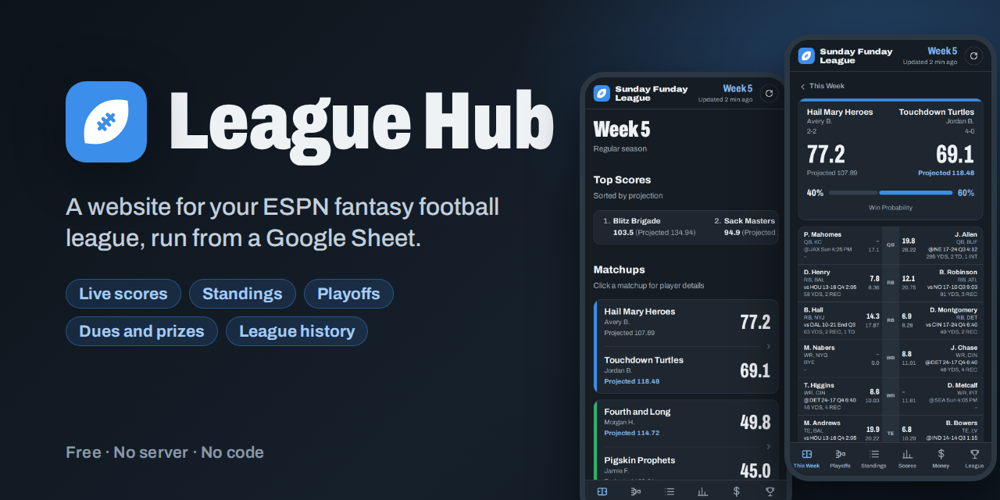
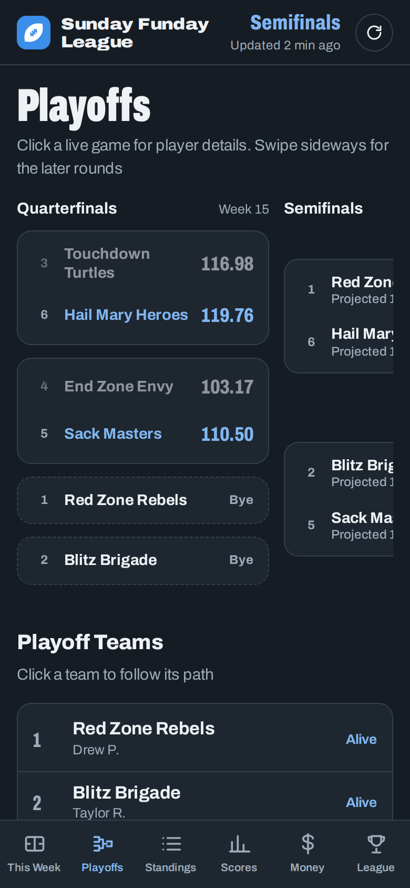
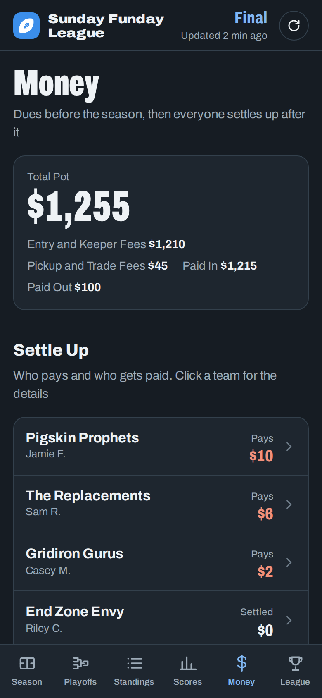
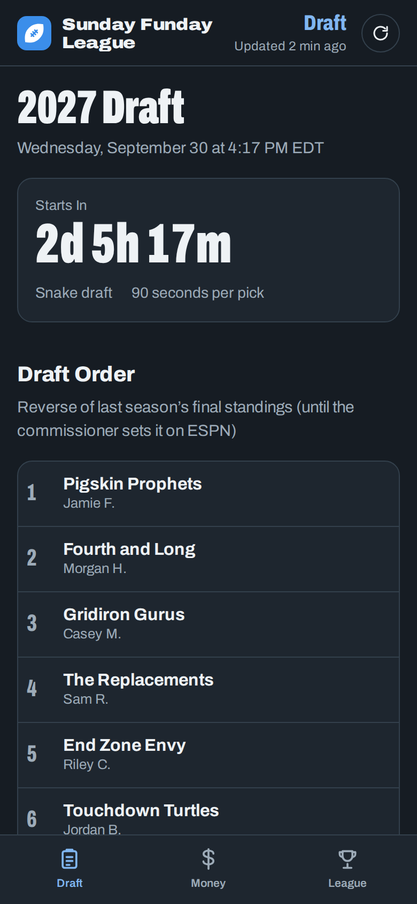

Live scores, standings, the playoff bracket, league money and history, on a page your whole league can open on their phones.
It's free, there's no server to run, and you don't need to write any code. Setup takes about 15 minutes.

**[Live demo](https://rcammerata.github.io/leaguehub/demo/)** · **[Set it up](docs/setup.md)** · [All guides](#guides)

  
  
  

**[Try the live demo](https://rcammerata.github.io/leaguehub/demo/)**. It's a made-up league you can click through at four points of a season: a live week, the playoffs, the end of the season and before the draft.

## Who it's for

Your league already plays on ESPN, and ESPN runs the games: drafts, lineups, waivers, trades and scoring. League Hub is for everything around the games that ESPN doesn't handle.

- **League money, tracked for you.** Entry fees and keeper fees before the season, pickup and trade fees as they happen, weekly high-score prizes and season prizes, and at the end, who pays and who gets paid. It's all worked out from ESPN automatically. You just record payments as they come in.
- **Your league's own rules and extras**, such as keeper fees by draft round, prizes ESPN doesn't know about, weekly high scores and a total points race.
- **League history in one place**: every champion, runner-up and top scorer from ESPN, and titles per manager.
- **One link for everyone**, with live projections from the NFL game clock and a win probability for every matchup.

Even if all you want is to stop tracking dues in a spreadsheet by hand, turn on the Money page and League Hub keeps the books for you.

## What your league gets

- **This Week**: every matchup with live scores and projections that update during games, plus a strip of the week's top scores.
- **Matchup pages**: both lineups side by side, with each player's game, score and clock, stats (like "82 YDS, 5 REC, 1 TD"; catches show in PPR leagues), injury tags (Q, O, IR), points and projection, plus a live win probability.
- **Standings**: overall and by division, with the playoff line.
- **Playoffs**: the playoff picture during the season, then the bracket (with byes and the third-place game). Click a team to follow its path.
- **Scores**: every finished week, weekly high scores and the season's total points race.
- **Money** (optional): dues before the season (entry and keeper fees), then a settle-up after it where pickup and trade fees are weighed against weekly and season prizes. It shows who has paid, and who pays or gets paid at the end. Payments are recorded in the sheet.
- **League**: your rules, this season's keepers (tagged with the round they were drafted in), and league history with every champion from ESPN.
- **Draft season**: after the league is renewed, a countdown to the draft, the draft order and the keepers.
- **Commissioner Tools**: a passcode-protected page to record payments, paste new ESPN cookies and update right away.

It works on phones and computers, in light and dark mode, with your league's color and logo.

## What you need

- A Google account (a free Gmail account is fine).
- An ESPN fantasy football league. Public leagues work right away. Private leagues need two cookies from your ESPN login, and the guide shows how to copy them.
- About 15 minutes. Only the commissioner sets it up. Everyone else just opens the link.

## Set it up

The full guide with every click is in **[docs/setup.md](docs/setup.md)**. In short:

1. Create a new Google Sheet ([sheets.new](https://sheets.new)).
2. Click **Extensions → Apps Script**. Replace everything in `Code.gs` with [dist/Code.gs](dist/Code.gs). Add an HTML file named `Index` and paste [dist/Index.html](dist/Index.html) into it. Save.
3. Back in the sheet, reload the page, then click **League Hub → Set up** and paste your ESPN league's web address.
4. In Apps Script, click **Deploy → New deployment → Web app** (Execute as: Me, Who has access: Anyone) and **Deploy**. The web app address is your league's website. Share it with the league.

Then change anything you like on the sheet's **Settings** tab: league name, color, fees and prizes, and what the website shows.

## Guides

| Guide | What's in it |
| --- | --- |
| [Setup](docs/setup.md) | Every step, including Google's "unverified app" screen |
| [Settings](docs/settings.md) | Every setting on the Settings tab |
| [Private leagues](docs/private-leagues.md) | Copying your ESPN cookies (espn_s2 and SWID) |
| [Money](docs/money.md) | Dues, fees, prizes, payments and the settle-up |
| [Hosting](docs/hosting.md) | Using the Apps Script link, or putting the page on your own site |
| [Troubleshooting](docs/troubleshooting.md) | What to do when something doesn't look right |
| [Updating](docs/updating.md) | Installing a new version of League Hub |
| [How it works](docs/how-it-works.md) | Updates, live projections, win probability, limits |
| [Development](docs/development.md) | The code, the tests and the sample league |

## Privacy

- League Hub runs in **your** Google account. The script only talks to ESPN (to read your league and the NFL scoreboard). The website page loads its font from Google Fonts.
- The website only shows what ESPN already shows league members: teams, scores and rosters. Manager names can be shortened ("Jordan B.") or hidden.
- ESPN cookies and the commissioner passcode are never put on the sheet or the website. They're kept in the script's private storage (Script Properties), and only a fingerprint of the passcode is stored.
- League Hub can only open the spreadsheet it's in, and it never sees your ESPN password.

## Good to know

- League Hub reads ESPN's fantasy data the same way ESPN's own website does. ESPN doesn't document this or promise it won't change. If ESPN changes something, League Hub may need an update.
- Scores update about every 5 minutes during games (you can choose 5, 10, 15 or 30), and less often when no games are on. Final scores always match ESPN.
- Google limits how much a free account's scripts can do each day. League Hub stays far below those limits (see [How it works](docs/how-it-works.md)).

League Hub isn't affiliated with, endorsed by or connected to ESPN. ESPN is a trademark of ESPN, Inc.

## License

MIT. See [LICENSE](LICENSE).
