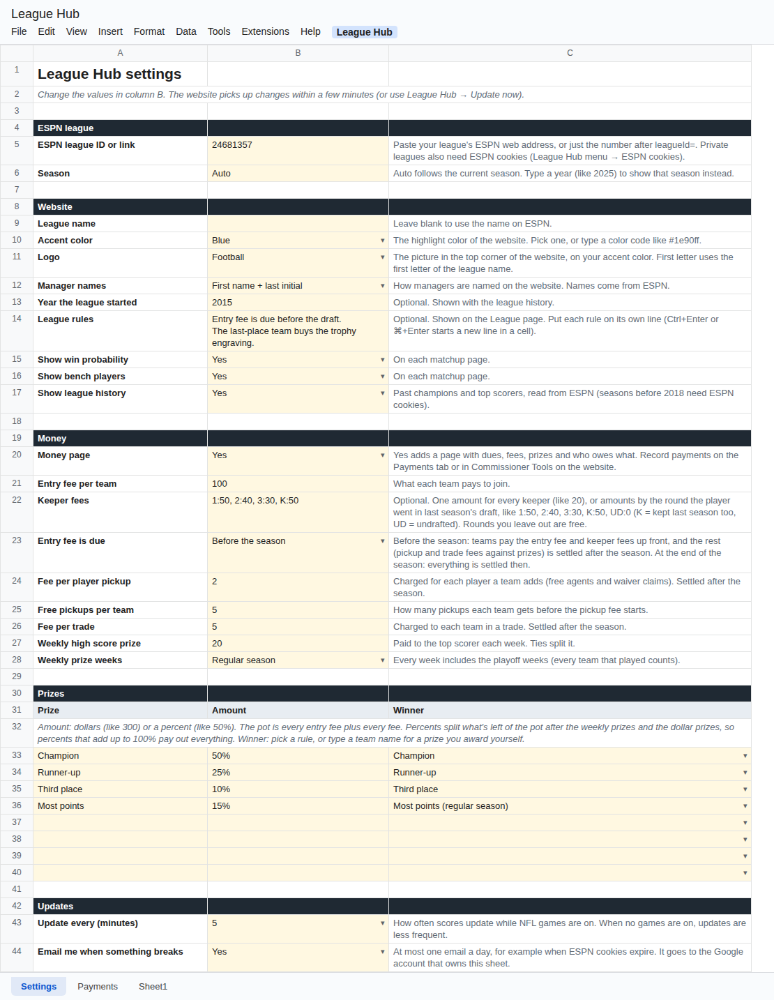

# Settings

Everything you can change lives on the **Settings** tab of your League Hub spreadsheet. Change the values in **column B** (the yellow cells). Many have a dropdown (the small arrow in the cell). Column C explains each one.

Changes show up on the website at the next update, which is within a few minutes. To see them right away, click **League Hub → Update now**.

If the tab ever gets messed up, click **League Hub → Set up (start here)** again. It rebuilds the tab and keeps every value you entered.

**Contents**

- [ESPN league](#espn-league)
- [Website](#website)
- [Money](#money)
- [Prizes](#prizes)
- [Updates](#updates)
- [What's not on the Settings tab](#whats-not-on-the-settings-tab)

---

## ESPN league

| Setting | What it does |
| --- | --- |
| **ESPN league ID or link** | Your league's address on ESPN (like `https://fantasy.espn.com/football/league?leagueId=12345678`) or just the number after `leagueId=`. Set up fills this in for you. |
| **Season** | **Auto** (the default) follows the current season: once you renew the league on ESPN for next year, the website switches to it and shows the draft countdown. Until then it shows the season that just ended. Type a year, like `2025`, to show that season instead. |

## Website

| Setting | What it does |
| --- | --- |
| **League name** | The name at the top of the website. Leave it blank to use the name on ESPN. |
| **Accent color** | The highlight color: Blue (the default), Green, Red, Purple, Orange, Teal, Pink or Gold. You can also type any color code, like `#1e90ff`. League Hub adjusts it so text stays readable in light and dark mode. |
| **Logo** | The picture in the top corner of the website (and on the browser tab), on your accent color: **Football** (the default), **Trophy**, **Goal post**, or **First letter** of the league name. |
| **Manager names** | How managers are named under each team: **First name + last initial** ("Jordan B.", the default), **Full name** ("Jordan Blake"), **ESPN username**, or **Hide** (team names only). Names come from the ESPN accounts in your league. |
| **Year the league started** | Optional. Shown on the League page ("Sunday Funday League, since 2015"). |
| **League rules** | Optional. Your league's own rules, shown on the League page under the rules League Hub reads from ESPN (team count, scoring, roster, playoffs, trade deadline and so on). Put each rule on its own line. To start a new line inside a cell, press **Ctrl+Enter** (**⌘+Enter** on a Mac). |
| **Show win probability** | **Yes** shows each team's chance to win on the matchup pages. See [How it works](how-it-works.md#win-probability). |
| **Show bench players** | **Yes** lists bench players under the starters on the matchup pages. |
| **Show league history** | **Yes** adds past champions, runners-up, third places and top scorers to the League page, read from ESPN. Seasons before 2018 need ESPN cookies, even for public leagues (ESPN's rule). |

## Money

The Money page is off until you turn it on. The [Money guide](money.md) explains the dues, the settle-up after the season, the pot and the prizes.

| Setting | What it does |
| --- | --- |
| **Money page** | **Yes** adds the Money page to the website. |
| **Entry fee per team** | What each team pays to join, like `100`. |
| **Keeper fees** | Only for keeper leagues. One amount for every keeper (like `20`), or amounts by the round the player was drafted in last season, like `1:50, 2:40, 3:30, K:50, UD:0`. `K` means the player was kept last season too, and `UD` means undrafted (picked up during the season). Rounds you leave out are free. |
| **Entry fee is due** | **Before the season** (the default): teams pay the entry fee and keeper fees up front, and pickup and trade fees are settled against prizes after the season. **At the end of the season**: everything is settled at once after the season. |
| **Fee per player pickup** | Charged for each player a team adds (free agents and waiver claims), like `2`. `0` for none. Settled after the season. |
| **Free pickups per team** | How many pickups each team gets before the pickup fee starts. |
| **Fee per trade** | Charged to **each** team in a trade. Settled after the season. |
| **Weekly high score prize** | Paid to the week's top scorer, like `20`. Ties split it. `0` for none. |
| **Weekly prize weeks** | **Regular season** (the default) or **Every week** (playoff weeks too, counting every team that played). |

## Prizes

Below the money settings is a small table with one row per prize. It starts with four examples you can change or delete:

| Prize | Amount | Winner |
| --- | --- | --- |
| Champion | 50% | Champion |
| Runner-up | 25% | Runner-up |
| Third place | 10% | Third place |
| Most points | 15% | Most points (regular season) |

- **Prize**: the name shown on the website.
- **Amount**: dollars (`300`) or a percent (`50%`). Percents split what's left of the pot after the weekly prizes and the dollar prizes, so percents that add up to 100% pay out everything. See [Money](money.md#prizes).
- **Winner**: pick a rule from the dropdown and League Hub fills in the winner when it's decided:
  - **Champion**, **Runner-up**, **Third place**: from the playoffs.
  - **Most points (regular season)**: the most points in the regular season, decided when the playoffs start.
  - **Most points (all season)**: the most points in all games including the playoffs, decided when the season ends.
  - **Best regular-season record**: the #1 team in the standings when the playoffs start.
  - **Last place**: the last-place team.
  - Or type a **team name** for a prize you award yourself (like "Best team name").

There's room for 8 prizes. Delete a row's contents to remove a prize.

## Updates

| Setting | What it does |
| --- | --- |
| **Update every (minutes)** | How often scores update while NFL games are on: 5, 10, 15 or 30. When no games are on, League Hub checks less often (every 30 minutes during the season, every 2 hours in the off-season, every 5 minutes around your draft). |
| **Email me when something breaks** | **Yes** sends you (the Google account that owns the sheet) at most one email a day if League Hub can't read your league, for example when private-league cookies expire. |

## What's not on the Settings tab

On purpose, a few things are kept out of the sheet so they can't be seen by anyone the sheet is shared with:

- **ESPN cookies**: **League Hub → ESPN cookies (private leagues)**. See [Private leagues](private-leagues.md).
- **Commissioner passcode**: **League Hub → Commissioner passcode**. Type `OFF` there to turn Commissioner Tools off.
- **Pausing updates**: **League Hub → Pause automatic updates**. The website keeps showing the last data until you resume.

Everything else League Hub shows (teams, schedule, scoring, roster spots, playoffs, keepers, trade deadline) comes from your league's settings on ESPN. Change those on ESPN.
